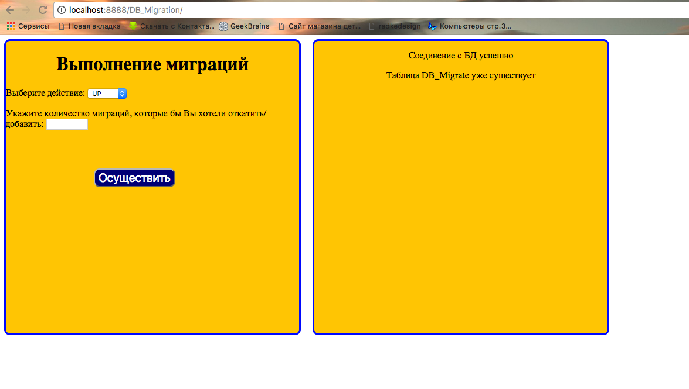

# Система для примененния и отмены миграций
Система позволяет разработчику создавать структуру базы данных с помощью применения SQL файлов, а также изменять структуру таблиц и отменять изменения.
SQL файлы находятся в двух каталогах:
+ up
+ down

## Системные требования
+ PHP 5.3+
+ MySQL 5.0+

## Преимущества системы
Система позволяет разработчику отказаться от ручного создания структуры базы данных. 
Теперь структура разбита на множество файлов, которые применяются и отменяются за считанные секунды.

Имеются 2 интерфейса для управления миграциями:
+ Консоль
+ Графический клиент

Подобные системы миграции содержат многие современные PHP - фреймворки.

## Подготовка к работе
+ Скачать и скопировать папку **DB_Migration** в корень проекта, с которым вы работаете
+ В файле **baseMigrate.php** ввести необходимые параметры подключения к базе данных вашего проекта

## Работа из графического клиента
Для работы с миграциями из графического клиента необходимо:
+ Запустить виртуальный сервер.
+ В строке запроса браузера укать путь: http://localhost/.../DB_Migration/

+ После того как вы попадете на страницу для работы из графического клиента необходимо выбрать:
	+ Действие:
		+ UP - применение миграций.
		+ DOWN - отмена миграций.
	+ Количество миграций
		+ Указать число необходимых миграций для применения или отмены.
	+ Нажать кнопку **Осуществить**.

## Работа из консоли
Для работы с миграциями из консоли необходимо:
+ Запустить файл **console.php** в консоли.
+ Выполнить необходимые консольные команды, которые описаны ниже.  

### Примеры консольных команд
+ php console.php up - Применени всех миграции.
+ php console.php up n - Применение "n" ближайших миграций.
+ php console.php down - Отмена всех миграций.
+ php console.php down n - Отмена "n" ближайших миграций.